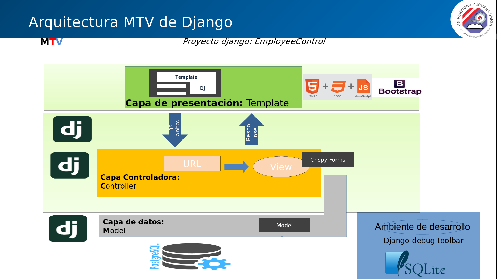

# EmployeeControl
Sistema de Asistencia de Empleados, para la UGEL LAMPA

## Arquitectura

## Iniciar Proyecto

pasos para iniciar el proyecto 

    git clone https://github.com/ADS2-20171/EmployeeControl.git
    cd EmployeeControl
    pip install -r requirements/local.txt
    python manage.py makemigrations blog --settings=config.settings.local
    python manage.py migrate --settings=config.settings.local
    python manage.py createsuperuser --settings=config.settings.local
    python manage.py runserver --settings=config.settings.local

### Url de prueba blog
    
    http://localhost:8000/blog/post/listar/

